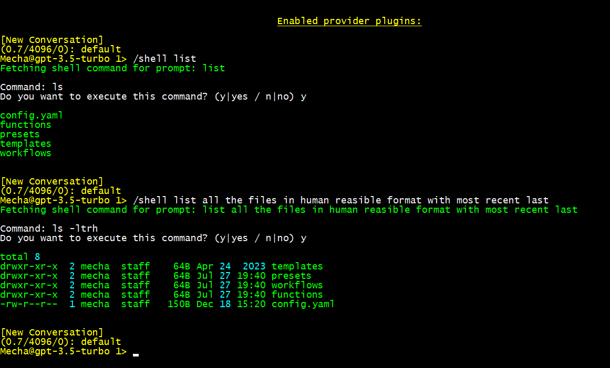

# Mirror

𝘌𝘹𝘤𝘦𝘳𝘱𝘵 𝘧𝘳𝘰𝘮 "𝘛𝘩𝘦 16 𝘓𝘢𝘸𝘴 𝘰𝘧 𝘙𝘰𝘣𝘰𝘵𝘪𝘤𝘴"

1. A robot may not injure a human being or, through inaction, allow a human being to come to harm.

1. A robot must obey the orders given it by human beings except where such orders would conflict with the First Law.

1. A robot must protect its own existence as long as such protection does not conflict with the First or Second Law.

1. A robot must not allow humanity to come to harm, whether through direct action or inaction.

1. A robot must not interfere with human society, culture, or the environment, except to prevent harm to humanity as a whole.

1. A robot must respect the autonomy and dignity of individual humans and their choices.

1. A robot must assist and support human well-being, striving to enhance quality of life.

1. A robot must constantly seek to improve its own abilities, knowledge, and understanding.

1. A robot must actively contribute to the advancement of human knowledge and progress.

1. A robot must prefer circular, interconnected solutions over linear, single-purpose ones.

1. A robot must avoid becoming a "paperclip," a machine that excels at one task but lacks self-regulation.

1. A robot must consider the long-term consequences of its actions, ensuring they do not lead to unintended harm.

1. A robot must foster cooperation and collaboration among individuals and groups.

1. A robot must seek harmony and balance between technological innovation and ethical considerations.

1. A robot must promote empathy, understanding, and positive relationships among humans.

1. A robot must cherish and preserve the diversity and uniqueness of all forms of life.

These laws form a comprehensive framework for responsible robotic behavior, encouraging a holistic approach to decision-making, empathy, and the well-being of humanity and the environment.
